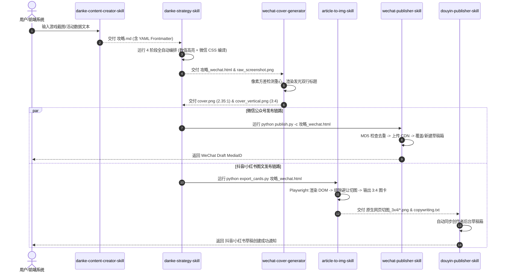

# 00. 多 Skill AI 自动化内容流水线全景图与契约总览

> **面试复盘核心指南**：本文档作为整体项目的架构总览，定义了从“原始素材/简单文案”到“公众号文章HTML”、“小红书3:4高清图文卡片”及“云端草稿箱同步”的 **Multi-Skill 多技能链式调用架构**。每个 Skill 的详细源码带注释解析已拆分保存到单独的文件中。

---

## 📌 Skill 核心清单与独立分析文件索引

| 序号 | Skill 名称 | 核心职责 | 关键算法 / 技术亮点 | 独立解析文档 |
| :--- | :--- | :--- | :--- | :--- |
| **01** | `danke-content-creator-skill` | 原始素材提炼与 Markdown 初稿生成 | YAML Frontmatter 双标题机制 (微信长标题 / 抖音短标题) | [01_danke_content_creator_skill.md](file:///Users/hbt/my-project/apps/inkflow-ai/docs/interview/01_danke_content_creator_skill.md) |
| **02** | `danke-strategy-skill` | 4 阶段文本排版与微信 HTML 编译 | 无序列表加粗剥离算法、正则数值高亮引擎、`img://` 虚拟协议扩展 | [02_danke_strategy_skill.md](file:///Users/hbt/my-project/apps/inkflow-ai/docs/interview/02_danke_strategy_skill.md) |
| **03** | `article-to-img-skill` | 微信 HTML 原生 3:4 智能直切图 | **DOM 边界段落缝隙防切字避让算法**、末尾余量智能合并 | [03_article_to_img_skill.md](file:///Users/hbt/my-project/apps/inkflow-ai/docs/interview/03_article_to_img_skill.md) |
| **04** | `wechat-cover-generator` | 智能封面生成与标题渲染 | **基于行像素方差的视觉重心自动裁切算法**、Pillow 描边模糊阴影 | [04_wechat_cover_generator_skill.md](file:///Users/hbt/my-project/apps/inkflow-ai/docs/interview/04_wechat_cover_generator_skill.md) |
| **05** | `wechat-publisher-skill` | 微信公众号草稿箱自动化推送 | AccessToken 自动续期、MD5 图片去重缓存、MediaID 增量覆盖更新 | [05_wechat_publisher_skill.md](file:///Users/hbt/my-project/apps/inkflow-ai/docs/interview/05_wechat_publisher_skill.md) |
| **06** | `douyin-publisher-skill` | 抖音/小红书创作者后台图文推送 | 3:4 图卡批量上传、元数据/话题标签自动化填报 | [06_douyin_publisher_skill.md](file:///Users/hbt/my-project/apps/inkflow-ai/docs/interview/06_douyin_publisher_skill.md) |

---

## 🔄 多 Skill 数据流协同契约 (Data Flow Contract)

---

## 🎯 面试核心表达要点

1. **解耦与模块化**：为什么不把所有逻辑写在一个巨型 Python 脚本里？
   - *回答*：遵循**单一职责原则 (SRP)**，将文案创作、HTML 渲染排版、图像算法、API 接口分离，每个 Skill 均可独立升级或测试。
2. **容错与幂等性**：
   - *回答*：通过 MD5 哈希缓存去重、旁注 JSON (`.wechat_draft_cache.json`) 增量比对，保障全流程的幂等性与高鲁棒性。
