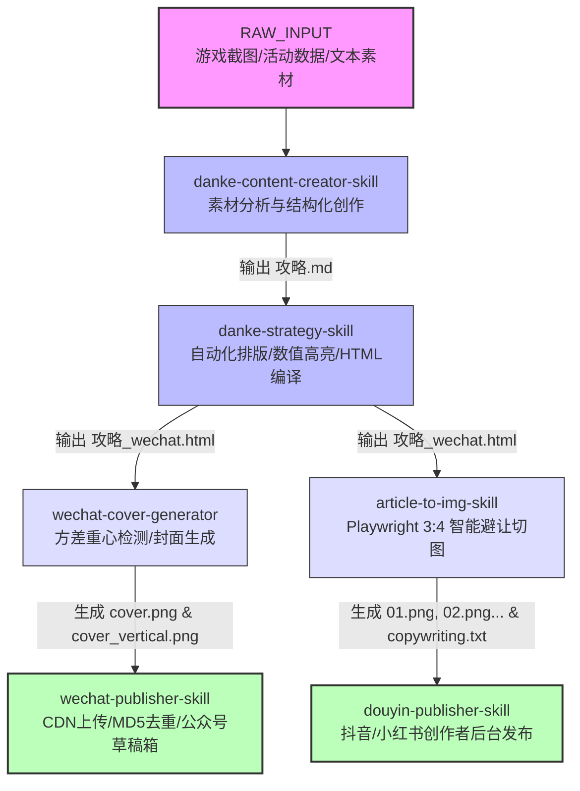

# 多技能 AI 内容全自动创作与发布流水线架构解析（面试复盘与技术全景）

> **本文档定位**：专为系统架构复盘与面试表达打造的技术全景指南。详细拆解从原始素材输入、初稿撰写、格式美化与 HTML 编译、原生 3:4 避让切图、智能封面渲染到微信/抖音多平台云端发布的全自动化 Multi-Skill 流水线。

---

## 目录 (Table of Contents)

1. [整体流水线架构与数据流全景图 (Pipeline DAG)](#1-整体流水线架构与数据流全景图)
2. [阶段一：素材解析与标准化初稿生成 (`danke-content-creator-skill`)](#2-阶段一素材解析与标准化初稿生成)
3. [阶段二：文本美化、智能排版与微信 HTML 编译 (`danke-strategy-skill`)](#3-阶段二文本美化智能排版与微信-html-编译)
4. [阶段三：原生 3:4 智能避让切图卡片导出 (`article-to-img-skill`)](#4-阶段三原生-34-智能避让切图卡片导出)
5. [阶段四：智能封面制作与视觉重心检测 (`wechat-cover-generator`)](#5-阶段四智能封面制作与视觉重心检测)
6. [阶段五：云端草稿发布与 MD5 去重跟踪 (`wechat-publisher-skill` & `douyin-publisher-skill`)](#6-阶段五云端草稿发布与-md5-去重跟踪)
7. [面试讲说指引：核心亮点与高频技术问答 (Interview Cheatsheet)](#7-面试讲说指引核心亮点与高频技术问答)

---

## 1. 整体流水线架构与数据流全景图

在现代全栈 AI 架构中，我们将复杂的文章创作与跨平台发布解耦为 6 个高内聚、低耦合的 **Skill 模组**。每个 Skill 遵循**单一职责原则 (SRP)**，通过明确的文件与 JSON 协议进行无缝串联：



---

## 2. 阶段一：素材解析与标准化初稿生成

### 2.1 核心职责与边界
- **Skill 名称**：`danke-content-creator-skill`
- **定位**：接收游戏活动原始截图、兑换比例、收益数据，通过结构化系统 Prompt 自动提炼并撰写标准 Markdown 初稿 `攻略.md`。

### 2.2 双标题与元数据 Frontmatter 规范
流水线下游需要同时对接微信公众号（长标题、横版封面）和小红书/抖音（短标题、竖版封面），因此初稿必须强制输出格式统一的 **YAML Frontmatter**：

```yaml
---
title: "【活动攻略】周年庆活动全解析——轻松满奖励策略" # 微信长标题 (≤64字)
social_title: "周年庆活动全解析！建议收藏"               # 小红书/抖音短标题 (≤20字，剥离【...】)
summary: "详细解析弹壳特攻队周年庆代币计算、兑换优先级与氪金提速建议。"
tags:
  - 弹壳特攻队
  - 游戏攻略
cover: "./cover.png"                   # 2.35:1 微信横版封面
cover_vertical: "./cover_vertical.png" # 3:4 小红书竖版封面
author: "弹壳呱呱"
date: 2026-08-26
---
```

### 2.3 技术实现要点
1. **结构化模版约束**：统一按照 `活动概述` → `收益/代币计算` → `兑换优先级` → `注意事项` 组织 Markdown 标题层级。
2. **防误导机制**：在数据表前自动植入警示块（如：`> 💡 本攻略未计算看广告获取的额外代币`）。

---

## 3. 阶段二：文本美化、智能排版与微信 HTML 编译

### 3.1 核心职责与边界
- **Skill 名称**：`danke-strategy-skill`
- **定位**：对初稿进行全自动化语法清理、专有名词自动加粗、数值正则色彩高亮、`img://` 虚拟图片协议替换，并编译为符合微信公众号渲染引擎规范的内联 CSS HTML（`攻略_wechat.html`）。

### 3.2 自动化 4 阶段工作流代码解析

```
[原始 Markdown] 
   └── 阶段一: 规范化加粗 + 剥离无序列表加粗 + 数值正则色彩注入 (highlight_rules.json)
   └── 阶段二: 行内简写扩展 {{共鸣伤害}} → {type=icon}
   └── 阶段三: Python `compile.py` 脚本注入内联 CSS + 转换外链为脚注
   └── 阶段四: 生成 攻略_wechat.html 目标页面
```

#### 关键算法逻辑：
- **无序列表加粗剥离算法**：微信公众号原生引擎在渲染 `- **文字**` 时存在严重换行折行 Bug。编译引擎在正则扫描时，自动针对无序列表项剥离加粗符号，恢复纯文本。
- **数值高亮正则引擎**：通过 `packs/danke/highlight_rules.json` 正则表达式：
  - 攻击/伤害相关数字匹配后注入红字 `<span style="color:#e64340;">+15%伤害</span>`
  - 生命/防御相关数字匹配后注入蓝字 `<span style="color:#576b95;">+20%生命</span>`

---

## 4. 阶段三：原生 3:4 智能避让切图卡片导出

### 4.1 核心职责与边界
- **Skill 名称**：`article-to-img-skill`
- **定位**：将微信 HTML 文章通过无头浏览器渲染后，按小红书/抖音标准 3:4 (1080×1440px, DPR=2) 从上到下切割为高品质图文卡片集，并生成 `copywriting.txt`。

### 4.2 智能段落缝隙避让算法 (Paragraph Gap Avoidance Algorithm)

传统等距切割会导致文字被从切成上下两半（切字 Bug）。本 Skill 采用基于 DOM 边界计算的算法：

```python
# 算法伪代码逻辑 (scripts/export_cards.py)
TARGET_HEIGHT = 1440  # 单张卡片目标高度 (px)
elements = page.query_selector_all("p, h1, h2, h3, li, img, section")

current_split_y = 0
for elem in elements:
    box = elem.bounding_box()
    # 如果当前元素底部突破了切图卡片的临界高度
    if box['y'] + box['height'] - current_split_y > TARGET_HEIGHT:
        # 在上一个元素的底部缝隙 (margin/padding) 处执行智能裁剪，避开元素主体！
        split_at(y=last_element_bottom)
        current_split_y = last_element_bottom
    last_element_bottom = box['y'] + box['height']
```

#### 技术优势：
- **零文字截断**：100% 避开所有 `<p>`、``、`<table>` DOM 元素。
- **超高清采样**：视口配置 `viewport={'width': 1080, 'height': 1440}, device_scale_factor=2`，输出媲美原生设计的图集。

---

## 5. 阶段四：智能封面制作与视觉重心检测

### 5.1 核心职责与边界
- **Skill 名称**：`wechat-cover-generator`
- **定位**：接收游戏/应用 9:16 原始截图，自动计算色彩方差检测视觉重心，智能裁切并叠加双行居中带发光描边阴影的高颜值标题（生成 2.35:1 微信封面与 3:4 竖版封面）。

### 5.2 基于行像素方差的视觉重心自动裁切算法

```python
# 算法核心 (make_cover.py)
import numpy as np
from PIL import Image

def detect_visual_center(image_path, target_height):
    img = Image.open(image_path).convert('RGB')
    arr = np.array(img)
    # 计算每一行像素的色彩标准差/方差 (Variance)
    row_variances = np.var(arr, axis=(1, 2))
    
    # 查找方差最大的区间（即色彩最丰富、UI细节最多的区域，通常是游戏角色或UI中心）
    max_var_sum = 0
    best_y = 0
    for y in range(0, arr.shape[0] - target_height):
        window_var = np.sum(row_variances[y : y + target_height])
        if window_var > max_var_sum:
            max_var_sum = window_var
            best_y = y
    return best_y  # 返回最佳裁剪起始 Y 坐标
```

#### 文字渲染支持：
使用 Pillow `ImageDraw` 绘制双层文字：底层绘制 4px 扩展黑色描边与模糊阴影，顶层绘制 `#FFD700` 金黄主字，确保在复杂游戏背景下依然极其醒目。

---

## 6. 阶段五：云端草稿发布与 MD5 去重跟踪

### 6.1 核心职责与边界
- **Skill 名称**：`wechat-publisher-skill` & `douyin-publisher-skill`
- **定位**：连接微信公众号 API 与抖音创作者后台，自动解析 HTML/切图，完成凭证续期、图片 CDN 上传、草稿新建/更新。

### 6.2 关键架构设计与去重缓存机制

1. **图片 CDN 自动化上传与 MD5 去重**：
   - 上传前计算本地图片的 `MD5` 哈希。
   - 维持本地 SQLite / JSON 缓存 `image_cache.json` (`{ md5_hash: wechat_cdn_url }`)。
   - 重复执行发布时，已上传图片秒级复用，极大提升 API 调用效率并节省网络流量。

2. **草稿 ID (MediaID) 跟踪与增量更新**：
   - 编译输出伴生旁注文件 `攻略_wechat.json`。
   - 首次发布后记录 `media_id`；二次发布时，通过微信 `draft/update` 接口原地更新草稿。若草稿已被手动删除，自动降级创建新草稿。

```python
# 核心逻辑 (scripts/publish.py)
def publish_draft(html_path, metadata):
    access_token = get_valid_access_token()
    # 1. 扫描 HTML 中所有 img 标签
    html_content = replace_images_with_cdn(html_path, access_token)
    
    # 2. 检查是否有已有 MediaID
    if metadata.get("media_id"):
        res = update_wechat_draft(metadata["media_id"], html_content, access_token)
        if res.get("errcode") == 0:
            return metadata["media_id"]
    
    # 3. 降级新建草稿
    media_id = create_new_wechat_draft(html_content, access_token)
    save_metadata(html_path, {"media_id": media_id})
    return media_id
```

---

## 7. 面试讲说指引：核心亮点与高频技术问答

### 💡 7.1 面试官提问：“请介绍一下你在项目中设计的多技能 (Multi-Skill) 自动化流水线”

> **回答范本**：
> “在这个项目中，我将传统的 AI 文章生成扩展为一个**全自动的分布式 Skill 流水线**。传统的 AI 工具往往直接返回一大段文字，而我们的真实业务场景需要从‘文案/截图’到‘公众号排版 HTML’、‘3:4 小红书图集’再到‘多平台草稿箱发布’的完整闭环。
> 我设计了 6 个单一职责的 Skill：
> 1. `danke-content-creator-skill` 负责根据游戏素材提炼生成带有标准 YAML Frontmatter 的 `攻略.md`；
> 2. `danke-strategy-skill` 负责专有名词加粗、数值正则色彩匹配与微信内联 CSS 样式编译；
> 3. `article-to-img-skill` 利用 Playwright 无头浏览器进行原生网页渲染，并配合我编写的**DOM 缝隙避让算法**，按 3:4 比例切割出高清无切字卡片；
> 4. `wechat-cover-generator` 基于行像素方差算法自动识别画面视觉重心并渲染带阴影描边的封面；
> 5. 最后由 `wechat-publisher-skill` 和 `douyin-publisher-skill` 完成凭证续期、MD5 图片去重与云端草稿箱同步。
> 整个过程无需人工干预，通过标准文件接口无缝串联。”

### 💡 7.2 面试官提问：“你在开发过程中遇到了什么技术难点？是如何解决的？”

> **回答范本**：
> “主要遇到了两个核心技术挑战：
> 
> **第一个是网页切图的‘文字裁断 Bug’**：小红书/抖音要求 3:4 (1080x1440) 比例图集，但直接固定像素切割会导致某些行文字或表格被砍掉一半。我设计了**DOM 临界缝隙避让算法**：在无头浏览器渲染完 DOM 后，实时计算元素 `bounding_box`，当发现某个段落突破 1440px 时，自动向回寻找最近的 `<p>` 或 `<li>` 缝隙执行切分，实现了 100% 避让截断。
> 
> **第二个是发布效率与接口频次限制问题**：微信公众号上传素材时网络消耗较大。我在发布 Skill 中设计了 **MD5 图片去重与 MediaID 增量更新机制**：上传前计算图片的 MD5，与本地缓存比对，避免重复上传 CDN；同时通过旁注 JSON 记录草稿 `media_id`，支持原地覆盖更新草稿，提升了整个流水线运行效率。”

### 💡 7.3 面试官提问：“项目代码中很多是 AI 写的，你平时是如何进行工程调优与代码理解的？”

> **回答范本**：
> “在现代 AI 辅助开发中，AI 极大地加速了样板代码的编写，但我作为软件架构师，核心精力放在**系统架构设计、边界契约定义与核心算法重构**上。
> 例如，最初 AI 生成的编译器在无序列表项中添加加粗会导致微信渲染错乱，我深入阅读了微信公众号渲染引擎源码，定位到是 `<ul>` 内部行内块元素的样式冲突，随后通过重构编译器在 Stage 1 增加了自动剥离无序列表加粗的正则规则。此外，像基于 OpenCV/Pillow 的行像素方差检测与 MD5 去重缓存，都是我主动设计并指导 AI 进行代码实现的。这种‘AI 快速生成 + 人工架构把关与深度调优’的方式，极大地提升了我的交付效率与代码把控力。”
